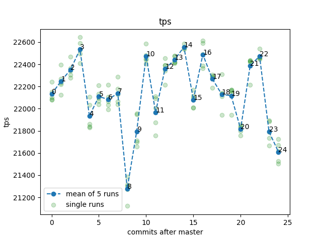
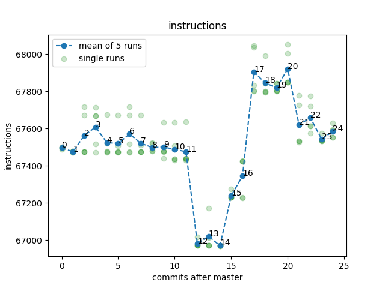
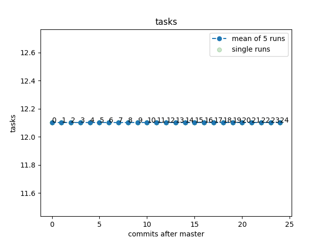
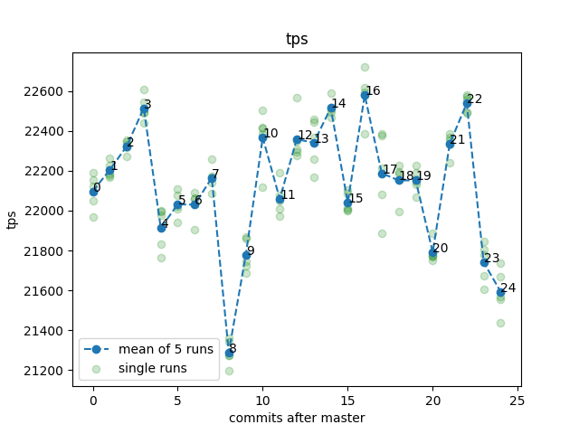
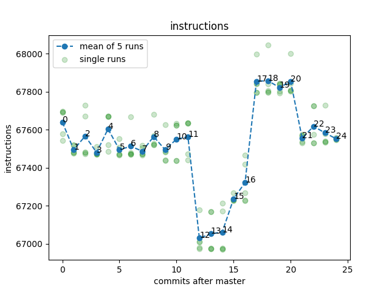

# Results of benchmarking term2-pr3 branch on a laptop throttled to 1GHz with very low inline threshold

```
./configure.py --mode release --clang-inline-threshold 16
```

## Workloads:
* small - 1000_000
* medium - 10_000_000
* big - 100_000_000 (not finished, would take too long)

## Command
```bash
build/release/test/perf/perf_simple_query --cpuset 1 -m 1G --task-quota-ms 10 --random-seed 0 --operations-per-shard {workload}
```

## Graphs

### Medium






### Small




