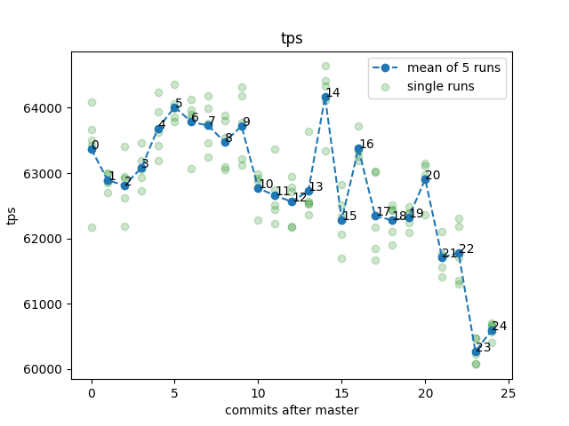
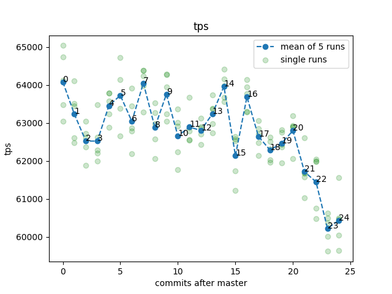
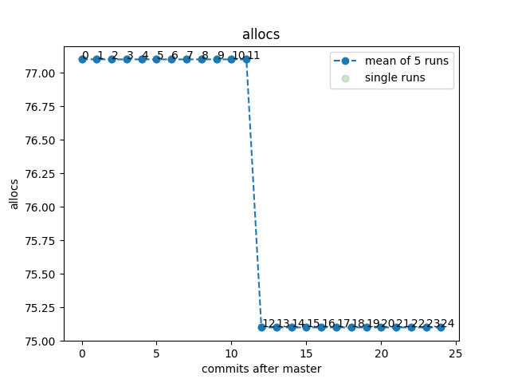
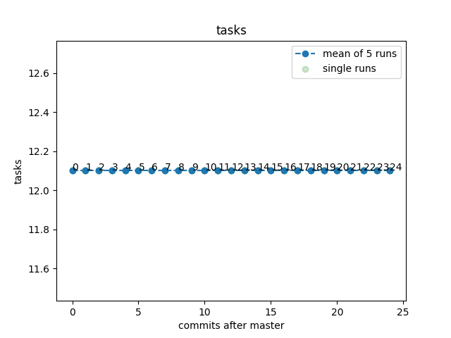

# Results of benchmarking term2-pr3 branch on an i3.4xlarge AWS machine
Instructions were 0 in all benchmarks for some reason 0_o

## Workloads:
* small - 1000_000
* medium - 10_000_000
* big - 100_000_000 (not finished, would take too long)

## Command
```bash
build/release/test/perf/perf_simple_query --cpuset 1 -m 1G --operations-per-shard {workload} --task-quota-ms 10
```

## Graphs

### Medium




### Small



