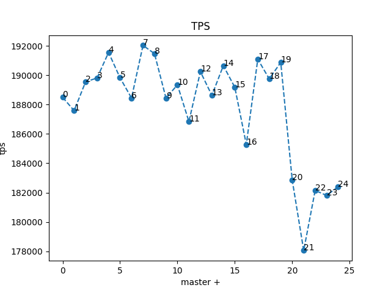
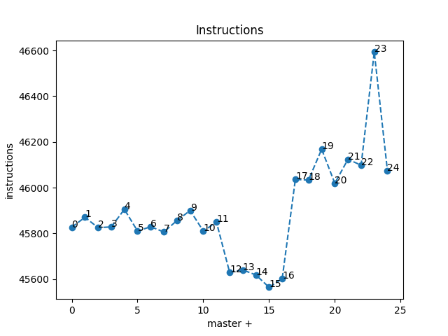
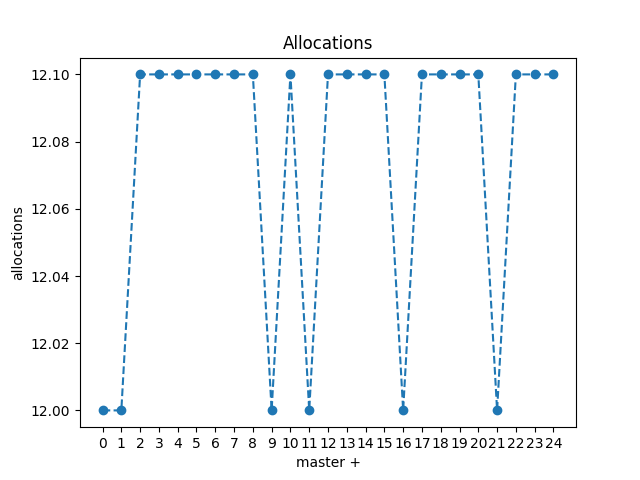
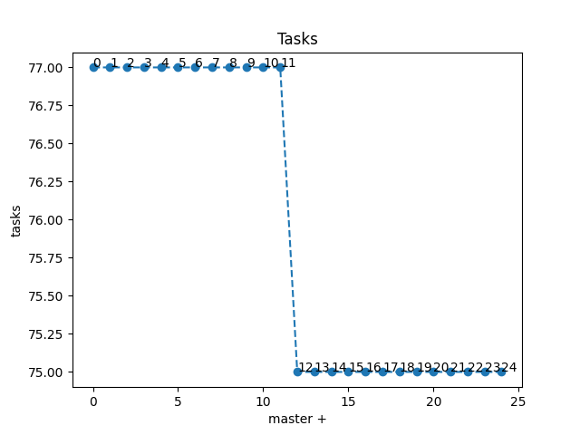

# Results of benchmarking term2-pr3 branch

Perf files are also available, but they take up 4.7GB of space so I didn't upload them here

## Contents
* `bench` - benchmarks done on normal release build
* `flame` - flamegraphs and benchmarks, build with `-fno-omit-frame-pointer` and running `_g` variant

## Workloads:
* small - 1000_000
* medium - 10_000_000
* big - 100_000_000

## Command
```bash
build/release/test/perf/perf_simple_query --cpuset 1 -m 1G --operations-per-shard {workload} --task-quota-ms 10
```

## Graphs





